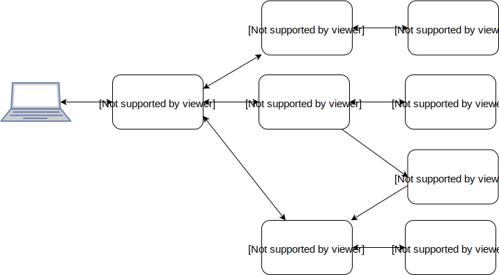

# Recipe Application

A simple application to consume recipe api services. This is for demo purposes and created to demonstrate architectural & programming skills.

### Application Architecture

> Below are the key-design points, and how its been handled & implemented.

##### Overview:



- **Web-Service Container:** This service will act as an API gateway and it will route all the calls to the appropriate services.
- **Oauth-Service Container:** This service will be used to create and generate access tokens. So, we could use them to access the protected API/endpoints.
- **Search-Service Container:** This service will take the query from the request and serve it by fetching the recipe results from Elasticsearch.
- **Recipe-Service Container:** This service will serve all the recipe related API endpoints.
- **Postgres-Recipe Container:** This database container will store all the recipe related data, hence will be accessed and consumed by recipe-service container.
- **Postgres-Oauth Container:** This database container will store all the oauth related data, hence will be accessed and consumed by oauth-service container.
- **Elasticsearch Container:** This noSQL database container will store all the recipe related data, hence will be accessed and consumed by search-service container.
- **Redis Container:** This in-memory key-value container will store all the recipe related events. Recipe-Service will product the events and Search-Service will consume the events.


### Installation

Development environment requirements:

- Docker >= 17.06 CE
- Docker Compose

Setting up your development environment on your local machine using setup script:

```bash
$ ./setup.sh
```

Manual setup:

```bash
$ cp recipe-service/.env.dev recipe-service/.env
$ cp oauth-service/.env.dev oauth-service/.env
$ cp search-service/.env.dev search-service/.env
$ cp web-service/.env.dev web-service/.env
$ docker-compose up -d
$ docker exec -it ahsanatiq-recipe-postgres createdb -U hellofresh -O hellofresh hellofresh_testing
$ docker exec -it ahsanatiq-oauth-service openssl genrsa -out /server/keys/id_rsa 2048
$ docker exec -it ahsanatiq-oauth-service openssl rsa -in /server/keys/id_rsa -pubout -out /server/keys/id_rsa.pub
$ docker exec -it ahsanatiq-recipe-service php vendor/bin/phinx migrate
$ docker exec -it ahsanatiq-oauth-service php vendor/bin/phinx migrate
$ docker exec -it ahsanatiq-oauth-service php vendor/bin/phinx seed:run
```

Now you can access the application via http://localhost:8000.

### Run Tests

Run the unit-tests in the Recipe-Service container:

```bash
$ docker exec -it ahsanatiq-recipe-service php vendor/bin/codecept run
```

Run the acceptance-tests in the Web-Service container:

```bash
$ docker exec -it ahsanatiq-web-service php vendor/bin/codecept run
```

### API documentation

You can access the public API documentation at [Postman](https://documenter.getpostman.com/view/23622/RzZDjxNb). To import and run all the API's, click "Run In Postman" on top bar, after installing and importing you will see the new collection as "HelloFresh-Recipes API". To access the protected API's, you need to run generate the token first from "Authentication -> Get Token" endpoint. Then update the "access_Token" in the "HelloFresh-Dev" environment setting by clicking on the top-right corner inside postman app.


